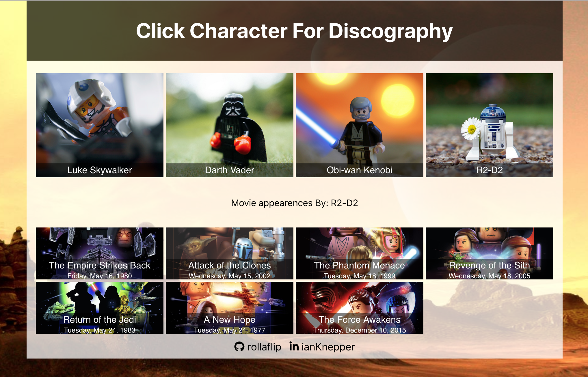

# Star Wars Disco
#### By Ian Knepper
Its live!  [Click for Deployed App](https://star-wars-disco.herokuapp.com/)

Star Wars Disco performs Axios requests to the SWAPI API and displays character discographies.<br>

NOTE: Obi-wan's URL is intentionally incorrect... Check out the app's error handling!

### To run Star Wars Disco locally:
Install dependencies via npm
```
npm install
```
Launch server in your broswer
```
npm start
```

Runs the app in development mode.<br>
Open [http://localhost:3000](http://localhost:3000) to view it in the browser.



## Built With:
* Javascript ES6
* React
* Styled w/ Material UI/ CSS Classes
* HTTP requests via Axios
* Bundled w/ webpack/ Babel
* Bootstrapped w/ Create React App
* Deployed w/ [Heroku](https://star-wars-disco.herokuapp.com/)
* Live Continuous Delivery VIA Heroku synced w/ gitHub
* SWAPI - [Star Wars API](http://swapi.co)

## Authors

* **Ian Knepper** - *Initial work* - (https://github.com/rollaflip)
